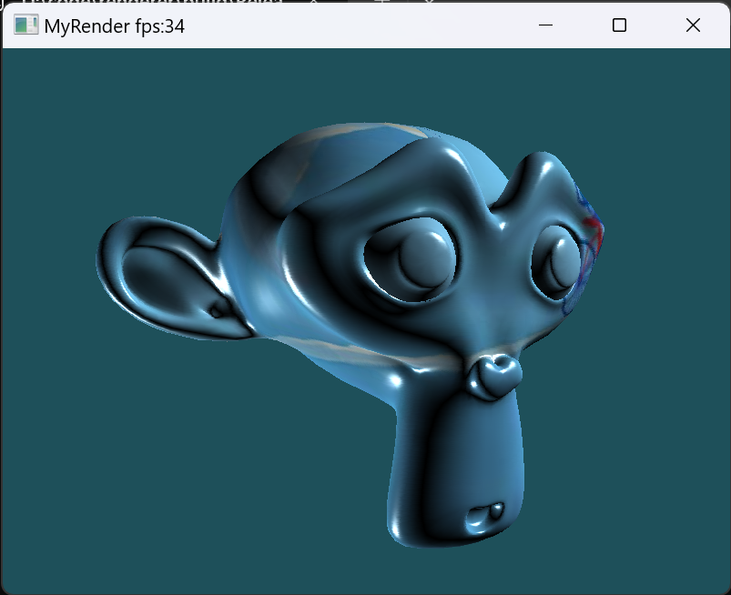
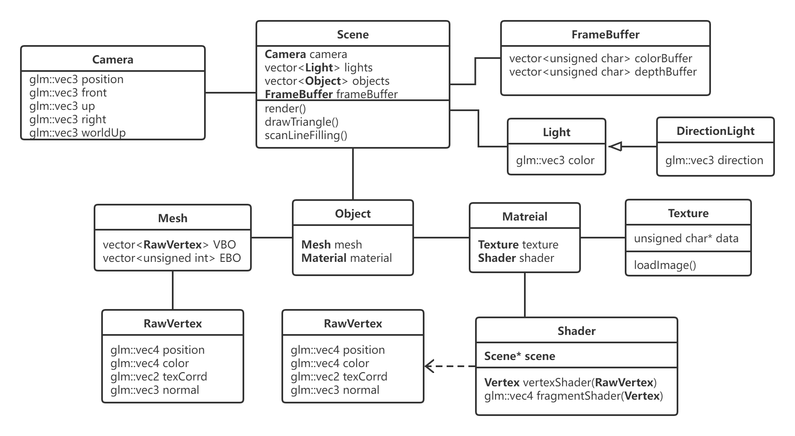
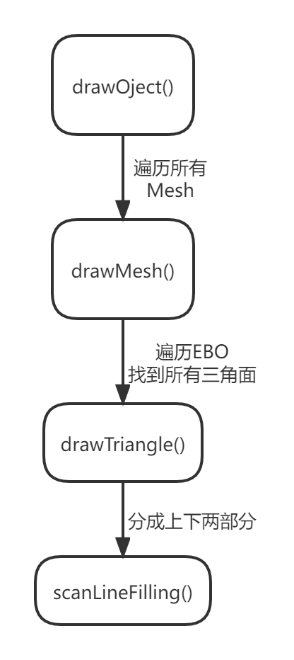
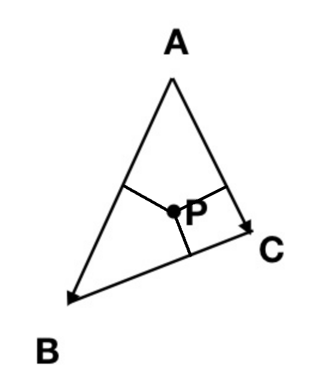

# 图形学项目——软光栅

从零开始实现一个软渲染器


## Update

[2024.1.24] 新增加载obj文件




## 依赖

位于`include`和`lib`文件夹下。

- GLFW  c++图形化界面库
- OpenGL  仅使用了`glViewport`与`glDrawPixels`两个函数
- glm  矩阵运算数学库
- stb_image.h  图片文件加载
- glad  用户加载OpenGL函数

## 类图



Scene类是整个场景类，包括了相机类Camera，场景中的灯光类Light，场景中需要渲染的所有构件Object以及屏幕像素缓冲区FrameBuffer。Scene类的render()方法是整个项目渲染流程的入口。

FrameBuffer类保存了所有屏幕缓冲区的像素信心，colorBuffer代表每个像素点的颜色，depthBuffer用于像素点绘制时的深度检测。

Light类是一个虚基类，DirectionLight继承了Light，实现了平行光的光照计算。

Camera相机类包含相机位置position，相机前向量front，相机上向量up，相机右向量right以及世界上向量worldUp等信息。每次通过键盘控制视角时都会更新相机参数，从而根据这些参数计算投影矩阵。

Object类包含材质类以及Mesh类。Mesh类包含了网格对象的所有信息，三角面的顶点索引序列EBO，以及每一个顶点的信息VBO。而材质类包括Texture贴图以及着色器Shader。Shader中定义了两个函数vertexShader()和fragmentShader()，分别是顶点着色器和片段着色器。

## 渲染流程

render()函数定义的渲染流程如下图。



### drawMesh

drawMesh()是render()中主要的逻辑部分，对于每一个Mesh对象的渲染流程如下。


#### 顶点着色器

- 计算世界坐标(World Position)
- 计算窗口坐标(Window Position)

Window Position = Project Matrix * View Matrix * Model Matrix * Position (MVP矩阵)

透视投影矩阵：
$$
\left(
\begin{array}{l}
\frac{n}{r} & 0 & 0 & 0 \\
0 & \frac{n}{t} & 0 & 0 \\
0 & 0 & \frac{-(f+n)}{f-n} & \frac{-2fn}{f-n} \\
0 & 0 & -1 & 0 \\
\end{array}
\right)
$$

主要代码：

```c++
Vertex Shader::vertexShader(const RawVertex& v) {
	Vertex result;
	result.worldPos = modelMatrix * v.position;
	result.windowPos = this->scene->projectMatrix * this->scene->viewMatrix * result.worldPos;
	result.z = 1 / result.windowPos.w; // 处理纹理透视映射
	result.worldPos *= result.z;
	result.color = v.color * result.z;
	result.normal = v.normal * result.z;
	result.texCoord = v.texCorrd * result.z;
	return result;
}
```

#### 剔除

背面剔除：相机正方向与三角面不一致时剔除

视锥剔除：计算当前摄像机对应的视锥平面(上下左右远近)，三个点都不在视锥中的平面剔除

cohen-sutherland裁剪：未实现


视锥剔除主要代码：

```c++
/*
* 视锥去除(上下左右前后)
*/
bool viewFrustumCutting(const Vertex& A, const Vertex& B, const Vertex& C, std::vector<glm::vec4>& planes) {
	glm::vec3 minPoint, maxPoint;
	glm::vec4* p = planes.data();
	minPoint.x = triMin(A.worldPos.x, B.worldPos.x, C.worldPos.x);
	minPoint.y = triMin(A.worldPos.y, B.worldPos.y, C.worldPos.y);
	minPoint.z = triMin(A.worldPos.z, B.worldPos.z, C.worldPos.z);
	maxPoint.x = triMax(A.worldPos.x, B.worldPos.x, C.worldPos.x);
	maxPoint.y = triMax(A.worldPos.y, B.worldPos.y, C.worldPos.y);
	maxPoint.z = triMax(A.worldPos.z, B.worldPos.z, C.worldPos.z);
	
	// near far
	if (distance(minPoint, *(p + 4)) < 0 || distance(maxPoint, *(p + 4)) < 0) return true;
	if (distance(minPoint, *(p + 5)) < 0 || distance(maxPoint, *(p + 5)) < 0) return true;

	// other plans
	for (int i = 0; i < 4; i++) {
		if (distance(minPoint, *(p + i)) < 0 || distance(maxPoint, *(p + i)) < 0) return true;
	}
	return false;
}
```

### drawTriangle

采用了两种绘制三角形的方法，分别是扫描线算法和边界函数算法。实际的渲染器中多采用边界函数算法，但是由于本项目是单线程运行，所以简单的扫描线算法效率更高。

#### 扫描线算法

将三角形分成上下两部分，分别绘制，每次填充一整条y轴的像素点。


主要代码：

```c++
/*
* 光栅化三角形
* 使用普通平面坐标系, 将三角形拆分成上下两部分分别使用扫描线算法进行填充与插值
*/
void Scene::drawTriangle(const Vertex& v1, const Vertex& v2, const Vertex& v3, Shader* shader) {

	// 将v1,v2,v3按照纵坐标由小到大排序
	Vertex arr[3] = { v1, v2, v3 };
	if (arr[0].windowPos.y > arr[1].windowPos.y) std::swap(arr[0], arr[1]);
	if (arr[1].windowPos.y > arr[2].windowPos.y) std::swap(arr[1], arr[2]);
	if (arr[0].windowPos.y > arr[1].windowPos.y) std::swap(arr[0], arr[1]);

	// 填充前初始化
	int minY = arr[0].windowPos.y, midY = arr[1].windowPos.y, maxY = arr[2].windowPos.y;
	int bottomHeight = midY - minY, upperHeight = maxY - midY, totalHeight = maxY - minY;

	Vertex leftPoint = Lerp(arr[0], arr[2], float(bottomHeight) / totalHeight);
	Vertex rightPoint = arr[1];
	if (leftPoint.windowPos.x > rightPoint.windowPos.x) std::swap(leftPoint, rightPoint);
	Vertex leftpos, rightpos;
	float weight;

	// 填充下半部分
	for (int y = minY; y < midY; y++) {
		weight = float(y - minY) / bottomHeight;
		leftpos = Lerp(arr[0], leftPoint, weight);
		rightpos = Lerp(arr[0], rightPoint, weight);
		scanLineFilling(leftpos, rightpos, shader);
	}

	// 填充上半部分
	for (int y = midY; y <= maxY; y++) {
		weight = float(y - midY) / upperHeight;
		leftpos = Lerp(leftPoint, arr[2], weight);
		rightpos = Lerp(rightPoint, arr[2], weight);
		scanLineFilling(leftpos, rightpos, shader);
	}
}
```

#### 边界函数算法

求三角形的包围区，对区域内的每一个点，判断它是不是在三角形内，如果在，就将其绘制。具体判断点位置采用的是计算点对于三角形重心坐标系的方法。


分块优化：

1. 完全在三角形内
2. 部分在三角形内
3. 完全在三角形外


重心坐标系：

- 重心坐标系下，x,y,z坐标均大于零则此点在三角形中
- 方便插值



计算重心坐标系：

```c++
/*
* 计算三角形重心坐标
*/
glm::vec3 getBarycentric(const Vertex& A, const Vertex& B, const Vertex& C, const glm::vec2& P) {
	glm::vec3 result;
	glm::vec2 AB(B.windowPos.x - A.windowPos.x, B.windowPos.y - A.windowPos.y);
	glm::vec2 AC(C.windowPos.x - A.windowPos.x, C.windowPos.y - A.windowPos.y);
	glm::vec2 AP(P.x - A.windowPos.x, P.y - A.windowPos.y);
	float S = AB.x * AC.y - AB.y * AC.x;
	result[1] = (AP.x * AC.y - AP.y * AC.x) / S;
	result[2] = (AB.x * AP.y - AB.y * AP.x) / S;
	result[0] = 1 - result[1] - result[2];
	return result;
}
```

### fragmentShader

#### 纹理映射

仿射纹理映射

仿射纹理映射的问题是纹理扭曲(如下图)，其原因在于线性插值不能计算在屏幕空间中不呈线性变化的量。因此它不适用于纹理坐标。投影到视平面时使用的是透视变换，这扭曲了这些数据。


透视纹理映射

顶点视平面中的透视坐标是与1/z成线性关系的，这样意味着计算3D空间中的纹理坐标u,v时，必须先将他们除以z，通过线性插值计算除以z后的值，然后再乘以z得到3d空间中的纹理坐标，这样得到的结果才是最终正确的纹理坐标。具体的代码实现见上文顶点着色器部分，正确的纹理渲染效果如下图。


#### 光照

漫反射：从各处看到的反射光线都是一致的，漫反射的强度只跟物体表面与光线夹角有关。

```c++
float diff = dot(normal, -lightDir);
vec3 result = diff * lightColor * vertexColor * Intensity;
```

镜面反射：强度取决于反射光线与观察方向

```c++
vec3 reflectDir = normalize(lightDir - 2 * dot(normal, lightDir) * normal); // 反射光方向
vec3 viewDir = normalize(cameraPos - worldPos); // 观察方向
float spec = pow(dot(reflectDir, viewDir), gloss);
vec3 result = spec * lightColor * Intensity
```

## 实时渲染效果


